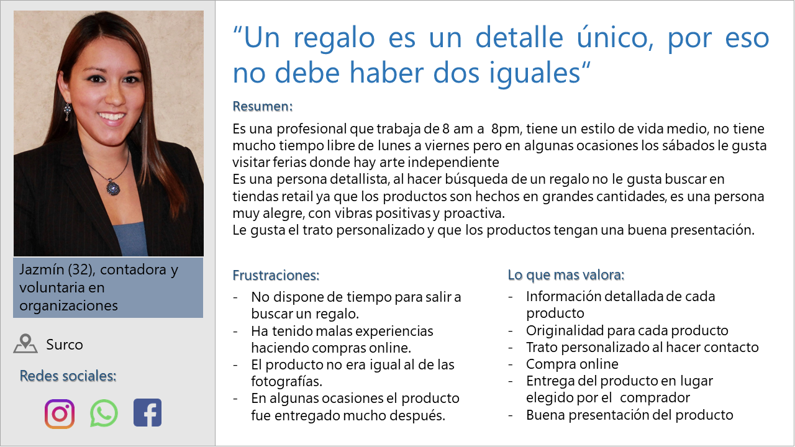
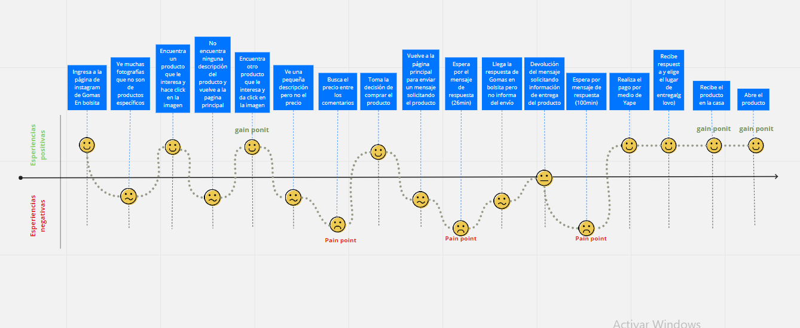
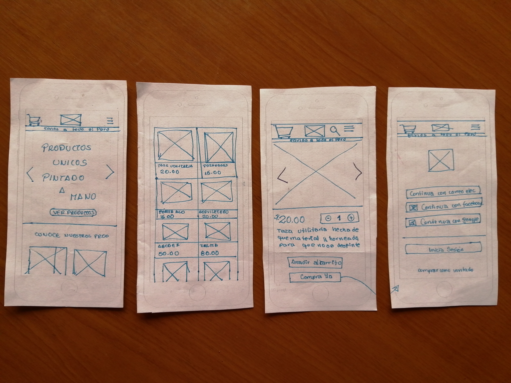
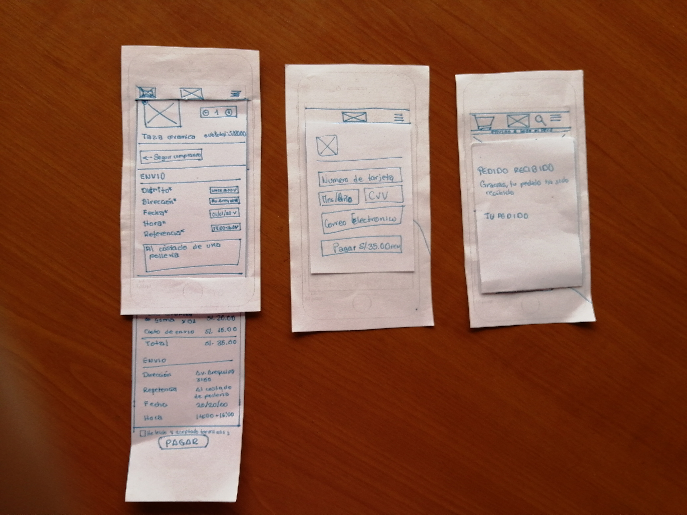
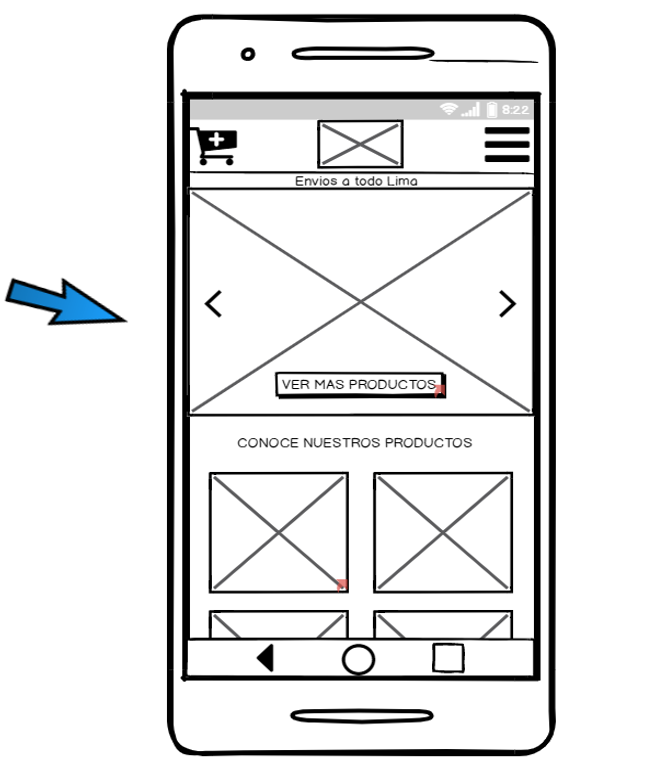

# Marketplace Gomas en bolsita
Gomas en bolsita es un emprendimiento que vende articulos únicos pintados a mano y articulos en serie con personajes creados por la propia Mariana, el objetivo de gomas en bolsita es lograr llenar de color y amor a través de objetos utilitarios la vida de las personas.
Gomas en bolsita no tiene tienda fisica, hace las ventas mediante pedidos por redes sociales como facebook e instagram y entregados por una empresa de delivery.

## OBJETIVOS:
- Conocer cual es el estado actual de Gomas en bolsita
- Conocer como interactuan los clientes actuamente mediante entrevistas
- Analizar la data obtenida e identificar problemas 
- Diseñar una pagina web que resuelva las necesidades identificadas.

## PROBLEMAS IDENTIFICADOS DEL CLIENTE
- Falta de conocimiento de compradores de que los productos son unicos.
- La marca no es tan conocida.

## PROBLEMAS IDENTIFICADOS DEL USUARIO
- No dispone de tiempo para salir a buscar un regalo.
- Ha tenido malas experiencias haciendo compras online.
- El producto no era igual al de las fotografías.
- En algunas ocasiones el producto fue entregado mucho después.
## DEFINICION DEL PUBLICO OBJETIVO
### User Persona 

	

### Customer journey map

	

### Definición de la solución

Página web responsive que transmita color y alegría, que tenga un catálogo de productos y que se vea las características de cada uno, enfatizando que son hechos a mano y que son únicos, que permita agregar el producto a un carrito de compras y ver la información de las cuentas a las que se realizará la transferencia para el pago también rellenar un formulario los datos del lugar y la hora a la que se hará el delivery.

### Diseño
#### Wireframes

	

	

### Mockups: [Mockup en Balsamiq](https://balsamiq.cloud/snt1y0w/pqt0sfk/r2278?f=N4IgUiBcCMA0IDkpxAYWfAMhkAhHAsjgFo4DSUA2gLoC%2BQA%3D)

<a href="https://balsamiq.cloud/snt1y0w/pqt0sfk/r2278?f=N4IgUiBcCMA0IDkpxAYWfAMhkAhHAsjgFo4DSUA2gLoC%2BQA%3D">

	

</a>	

